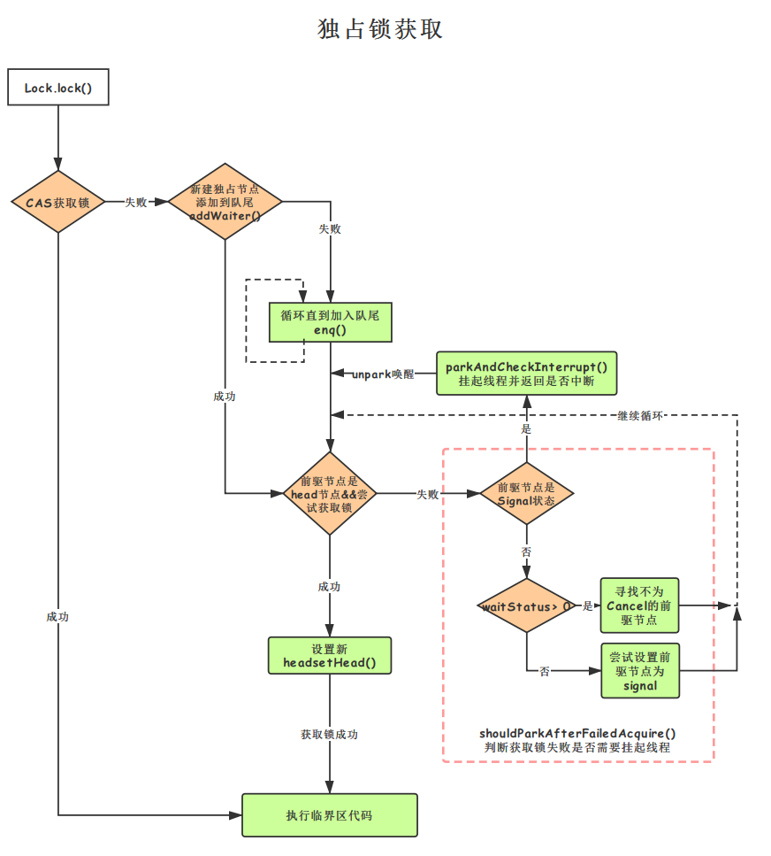

### 锁实现的基本原理

为了实现一把具有阻塞或唤醒功能的锁，需要具备几个核心要素：

- 需要一个state变量，标记该锁的状态。state变量至少有两个值：0、1。对state变量的操作，要确保线程安全，也就是会用到CAS。

- 需要记录当前是哪个线程持有锁。

- 需要底层支持对一个线程进行阻塞或唤醒操作。

- 需要有一个队列维护所有阻塞的线程。这个队列也必须是线程安全的无锁队列，也需要用到CAS。

> 在AQS中，state取值不仅可以是0、1，还可以大于1，就是为了支持锁的重入性。

|  字段和属性值   | 含义  |
|  ----  | ----  |
| status = 0  | 表示没有线程持有锁，exclusiveOwnerThread = null |
| status = 0  | 表示有一个线程持有锁，exclusiveOwnerThread = 该线程 |
| status > 1  | 表示该线程重入了该锁 |

### 伪代码实现
```java

ReentrantLock lock = new ReentrantLock(false);//false为非公平锁，true为公平锁
3个线程
T0 T1 T2
lock.lock() //加锁
    while(true){
        if（cas加锁成功){//cas->比较与交换compare and swap，
            break;跳出循环
        }
        LikedQueued()
        LikedQueued.put(Thread)
        // 进行阻塞。
        LockSupport.park();
        
        
    }
    
    T0获取锁
    xxxx业务逻辑
    xxxxx业务逻辑
    
lock.unlock() //解锁
Thread  t = LikedQueued.take();
// 唤醒指定的线程t继续循环
LockSupport.unpark(t)；

```


### AQS具备特性

阻塞等待队列 共享/独占 公平/非公平 可重入 允许中断

### AQS原理概览

AQS本质上是一种管程实现，其内部有一个双端队列，称为CLH队列。这个队列的主要特定是利用双向链表的操作特定（FIFO，先入先出）保证资源操作分配的公平性，利用双向链表的结构特定保证各个节点简的操作状态可知，利用Node节点所代表的线程的自旋操作方式提高资源操作权获取性能。

AQS中实现的CLH队列有以下几个特定：

- 所有状态正常的节点只能由队列头部离开队列。但是当CLH队列主动清理状态不正常的节点（CANCELLED状态的节点）时，这些状态不正常的节点不一定从队列头部离开。
- CLH队列只能从尾部添加节点，由于存在多个线程同时要求添加节点的场景，因此CLH队列要解决的一个关键问题就是如何从尾部正确添加节点。
- CLH队列在初始化完成的瞬间，其头节点引用head和尾结点引用tail指向同一个节点，这时这个节点没有任何实际意义。也就是说，真正被阻塞等待获取资源操作权的节点，至少是从CLH队列的第二个节点开始的，而不是从头节点开始。头节点引用head要么代表当前已经获取资源操作权的节点，要么没有实际意义。


先来看下AQS中最基本的数据结构——Node，Node即为CLH变体队列中的节点。

解释一下Node中几个方法和属性值的含义：

|  方法和属性值   | 含义  |
|  ----  | ----  |
| waitStatus  | 当前节点在队列中的状态 |
| thread  | 表示处于该节点的线程 |
| prev  | 前驱指针 |
| predecessor  | 返回前驱节点，没有的话抛出npe |
| nextWaiter  | 指向下一个处于CONDITION状态的节点 |
| next  | 后继指针 |

waitStatus有下面几个枚举值：

|  字段和属性值   | 含义  |
|  ----  | ----  |
| SIGNAL = -1  | 表示线程可被唤醒，等待锁的分配。|
| CANCELLED = 1 | 在同步队列中等待的线程等待超时或被中断，需要从同步队列中删除该Node的节点。 |
| CONDITION = -2  | 表示节点处于等待队列中，等待被唤醒。 |
| CONDITION = -3|只有当前线程处于SHARED情况下，该字段才会使用，用于共享锁的获取。|
| 0  | Node初始创建时默认为0 |

### 源码分析：通过ReentrantLock理解AQS


```
public class Test {
    private static final ReentrantLock LOCK = new ReentrantLock();

    public void run() {
        LOCK.lock();
        try {
            //dosomething
        }finally {
            LOCK.unlock();
        }
    }
}
```

> 默认情况下, ReentrantLock使用非公平锁的形式。

### 公平锁与非公平锁

```java
// 非公平锁实现
static final class NonfairSync extends Sync {
	final void lock() {
        // 先尝试CAS获取锁
        if (compareAndSetState(0, 1))
            setExclusiveOwnerThread(Thread.currentThread());
        else
            // 再排队
            acquire(1);
    }
    ...
}
// 公平锁实现
static final class FairSync extends Sync {
    private static final long serialVersionUID = -3000897897090466540L;
	// 去排队
    final void lock() {
        acquire(1);
    }
    ...
}

```

### acquire

```java
// 如果第一次获取锁失败，说明此时有其他线程持有锁，所以执行acquire
public final void acquire(int arg) {
    if (!tryAcquire(arg) &&
        acquireQueued(addWaiter(Node.EXCLUSIVE), arg))
        selfInterrupt();
}

```

### tryAcquire

```java
// 调用非公平锁的tryAcquire，再一次尝试去获取锁
protected final boolean tryAcquire(int acquires) {
    return nonfairTryAcquire(acquires);
}

// 返回false表明没有获取到锁，true表明成功获取锁/重入锁
final boolean nonfairTryAcquire(int acquires) {
    // 获取当前线程
    final Thread current = Thread.currentThread();
    // 获取state状态
    int c = getState();
    // 如果state是0，表明当前没有线程获取锁
    if (c == 0) {
        // 尝试去获取锁，获取成功就设置独占线程为当前线程
        if (compareAndSetState(0, acquires)) {
            setExclusiveOwnerThread(current);
            return true;
        }
    }
    // 如果当前线程已经是独占线程，此时说明锁重入了
    else if (current == getExclusiveOwnerThread()) {
        // 修改state的值
        int nextc = c + acquires;
        if (nextc < 0)
            throw new Error("Maximum lock count exceeded");
        // 设置state值，因为此时的获取锁的线程就是当前线程
        setState(nextc);
        return true;
    }
    return false;
}

>Q: 为什么有的地方使用setState()，有的地方使用CAS？

A: 因为使用setState()方法的前提是已经获取了锁，使用了CAS的是因为此时还没有获取锁。

// 公平锁的tryAcquire实现
protected final boolean tryAcquire(int acquires) {
    ...
        if (c == 0) {
            // hasQueuedPredecessors是公平锁的主要体现
            if (!hasQueuedPredecessors() &&
                compareAndSetState(0, acquires)) {
                setExclusiveOwnerThread(current);
                return true;
            }
        }
    ...
}

```

> hasQueuedPredecessors是公平锁加锁时判断等待队列中是否存在有效节点的方法。如果返回False，说明当前线程可以争取共享资源；如果返回True，说明队列中存在有效节点，当前线程必须加入到等待队列中。

### hasQueuedPredecessors

```java
    // 如果当前线程前面有一个排队的线程，则为 true ；如果目前线程位于队列的头部或队列为空，则 false 
    public final boolean hasQueuedPredecessor(){
        Node t = tail;
        Node h = head;
        Node s;
        return h != t &&
                ((s = h.next) == null || s.thread != Thread.currentThread());
    }
```


> 双向链表中，第一个节点为虚节点，其实并不存储任何信息，只是占位。真正的第一个有数据的节点，是在第二个节点开始的。当h != t时： 如果(s = h.next) == null，等待队列正在有线程进行初始化，但只是进行到了Tail指向Head，没有将Head指向Tail，此时队列中有元素，需要返回True（这块具体见下边代码分析）。 如果(s = h.next) != null，说明此时队列中至少有一个有效节点。如果此时s.thread == Thread.currentThread()，说明等待队列的第一个有效节点中的线程与当前线程相同，那么当前线程是可以获取资源的；如果s.thread != Thread.currentThread()，说明等待队列的第一个有效节点线程与当前线程不同，当前线程必须加入进等待队列。


### addWaiter

当执行Acquire(1)时，会通过tryAcquire获取锁。在这种情况下，如果获取锁失败，就会调用addWaiter加入到等待队列中去，具体实现方法如下：

```java
private Node addWaiter(Node mode) {
        // 通过当前的线程和锁模式新建一个节点,并将该节点设置为新的尾结点
        Node node = new Node(Thread.currentThread(), mode);
        Node pred = tail;
        if (pred != null) {
            node.prev = pred;
            // 通过compareAndSetTail方法，完成尾节点的设置。
            if (compareAndSetTail(pred, node)) {
                pred.next = node;
                return node;
            }
        }
        // 尾节点为null 或 插入尾节点失败
        enq(node);
        // 返回当前节点
        return node;
    }
```

### enq()

如果Pred指针是Null（说明等待队列中没有元素），就需要看一下Enq的方法。

```java
// 循环执行插入操作，直到插入队尾成功
private Node enq(final Node node) {
    for (;;) {
        Node t = tail;
        // 如果尾节点是null，说明队列还没有初始化
        if (t == null) {
            // 将head设置成空node，并且tail=head(说明此时队列初始化了但还没有节点)
            if (compareAndSetHead(new Node()))
                tail = head;
        } else {
            // t!=null，设置node.prev=t
            node.prev = t;
            // CAS设置node到队尾，如果不成功继续循环获取tail直到设置成功
            if (compareAndSetTail(t, node)) {
                // CAS成功，设置t的next属性
                t.next = node;
                // 跳出循环返回node的前驱节点
                return t;
            }
        }
    }
}
```

### acquireQueued

上文解释了addWaiter方法，这个方法其实就是把对应的线程以Node的数据结构形式加入到双端队列里，返回的是一个包含该线程的Node。而这个Node会作为参数，进入到acquireQueued方法中。acquireQueued方法可以对排队中的线程进行“获锁”操作。总的来说，一个线程获取锁失败了，被放入等待队列，acquireQueued会把放入队列中的线程不断去获取锁，直到获取成功或者不再需要获取（中断）。

```java
// 至此node已经插入队列成功，并返回。线程要开始阻塞了
final boolean acquireQueued(final Node node, int arg) {
        // 标记是否成功拿到资源
        boolean failed = true;
        try {
            boolean interrupted = false;
            // 开始自旋，要么获取锁，要么中断
            for (;;) {
                // 返回该节点的前驱节点
                final Node p = node.predecessor();
                // 节点阻塞之前，再尝试获取一次锁
                // 若当前节点的前驱节点为头节点，则node再次尝试去获取锁
                if (p == head && tryAcquire(arg)) {
                    // 获取锁成功，设置头节点为node，并清空thread和prev属性
                    setHead(node);
                    p.next = null; // help GC
                    failed = false;
                    // 跳出循环并返回
                    return interrupted;
                }
                // 说明p为头节点且当前没有获取到锁（可能是非公平锁被抢占了）
                // 或者是p不为头结点，这个时候就要判断当前node是否要被阻塞
                //（被阻塞条件：前驱节点的waitStatus为-1），防止无限循环浪费资源。
                if (shouldParkAfterFailedAcquire(p, node) &&
                    parkAndCheckInterrupt())
                    interrupted = true;
            }
        } finally {
            // 若是正常结束，failed则为false；若是执行期间发生异常，failed 为true 则执行cancelAcquire, 标注当前节点的生命状态为canceld
            if (failed)
                cancelAcquire(node);
        }
    }
```

> 线程一旦进入acquireQueued，就会被无限期阻塞，即使有其他线程调用interrupt()函数也不能将其唤醒，除非有其他线程释放了锁，并且该线程拿到了锁，才会从acquireQueued中返回。

### shouldParkAfterFailedAcquire

```java
// 判断获取锁失败之后是否需要park
private static boolean shouldParkAfterFailedAcquire(Node pred, Node node) {
        // Node的节点第一次进入该方法的时候，node前驱节点的waitStatus的值都为0
        // 因此都会执行该方法 ==> compareAndSetWaitStatus(pred, ws, Node.SIGNAL)
        // 修改成sinal=-1,标记处可以被唤醒.
        int ws = pred.waitStatus;
        // 如果是signal，表示线程可被唤醒
        if (ws == Node.SIGNAL)
            return true;
        // 通过枚举值我们知道waitStatus>0是取消状态
        if (ws > 0) {
            // 循环向前查找取消节点，把取消节点从队列中剔除
            do {
                node.prev = pred = pred.prev;
            } while (pred.waitStatus > 0);
            pred.next = node;
        } else {
             // 首先第1轮循环、修改head的状态，修改成sinal=-1标记处可以被唤醒.
             // 第2轮循环，阻塞线程，并且需要判断线程是否是有中断信号唤醒的！
             // 设置前驱节点等待状态为SIGNAL,设置signal的作用是什么？
             // 在解锁的时候只有head!=null且为signal状态才会唤醒head的下个节点
             // 如果pred状态设置成功，第二次就会进入ws == Node.SIGNAL，返回true
            compareAndSetWaitStatus(pred, ws, Node.SIGNAL);
        }
        return false;
}
```

### parkAndCheckInterrupt

```java
// 将线程挂起并检查是否被中断
private final boolean parkAndCheckInterrupt() {
    // 挂机当前线程，不会往下执行了
    LockSupport.park(this);
    // 往下执行的条件: unpark(t)或被中断
    // 返回中断状态(并清空中断状态)
    return Thread.interrupted();
}
```

> LockSupport.park()除了能够被unpark()唤醒，还会响应interrupt()打断，但是Lock锁不能响应中断，如果是unpark，会返回false，如果是interrupt则返回true。也因为LockSupport.park() 可能被中断唤醒，acquireQueued()函数才写了一个for死循环。唤醒之后，如果发现自己排在队列头部，就去拿锁；如果拿不到，则再次自己阻塞自己。不断重复此过程，直到拿到锁。

### 独占锁获取执行流程



### cancelAcquire

通过cancelAcquire方法，将Node的状态标记为CANCELLED。接下来，我们逐行来分析这个方法的原理：

```java
// 节点取消获取锁
  private void cancelAcquire(Node node) {
      // 忽略不存在的node
      if (node == null)
          return;
      // 设置该节点不关联任何线程，也就是虚节点
      node.thread = null;
  
      // 通过前驱节点，跳过取消状态的node
      Node pred = node.prev;
      while (pred.waitStatus > 0)
          node.prev = pred = pred.prev;
  
      // 获取有效前驱节点的后继节点
      Node predNext = pred.next;
  
      // 设置node节点为cancel状态
      node.waitStatus = Node.CANCELLED;
  
    // 如果当前节点是尾节点，将从后往前的第一个非取消状态的节点设置为尾节点
    // 更新失败的话，则进入else，如果更新成功，将tail的后继节点设置为null
      if (node == tail && compareAndSetTail(node, pred)) {
          // 设置尾节点pred的next指针为null
          compareAndSetNext(pred, predNext, null);
      } else {
          int ws;
            // 如果当前节点不是head的后继节点，1:判断当前节点前驱节点的是否为SIGNAL，2:如果不是，则把前驱节点设置为SINGAL看是否成功
            // 如果1和2中有一个为true，再判断当前节点的线程是否为null
            // 如果上述条件都满足，把当前节点的前驱节点的后继指针指向当前节点的后继节点
          if (pred != head &&
              ((ws = pred.waitStatus) == Node.SIGNAL ||
               (ws <= 0 && compareAndSetWaitStatus(pred, ws, Node.SIGNAL))) &&
              pred.thread != null) {
              Node next = node.next;
             
              if (next != null && next.waitStatus <= 0)
                  compareAndSetNext(pred, predNext, next);
          } else {
              // 如果当前节点是head的后继节点，或者上述条件不满足，那就唤醒当前节点的后继节点
              unparkSuccessor(node);
          }
          node.next = node;
      }
  }

```

### 如何解锁

我们已经剖析了加锁过程中的基本流程，接下来再对解锁的基本流程进行分析。由于ReentrantLock在解锁的时候，并不区分公平锁和非公平锁，所以我们直接看解锁的源码：

### unlock

```java
public void unlock() {
	sync.release(1);
}
```

### release

```java
public final boolean release(int arg) {
    // 尝试释放锁:如果返回true，说明该锁没有被任何线程持有
    // 则继续唤醒其他线程，抢锁。
    if (tryRelease(arg)) {
        // 获取头结点
        Node h = head;
        // 头结点不为空并且头结点的waitStatus不是初始化节点情况，唤醒其他已经阻塞的线程继续抢锁（解除线程挂起状态）
        if (h != null && h.waitStatus != 0)
            // 唤醒头节点的后继节点
            unparkSuccessor(h);
        // 唤醒的线程会重新从parkAndCheckInterrupt()方法中被unpark
        // 然后继续新一轮的获取锁或者获取不到锁park的流程    
        return true;
    }
    return false;
}
```

>这里的判断条件为什么是h != null && h.waitStatus != 0？

- h == null ==> 表示Head还没初始化。初始情况下，head == null，第一个节点入队，Head会被初始化一个虚拟节点。所以说，这里如果还没来得及入队，就会出现head == null 的情况。

- h != null && waitStatus == 0 ==> 表明后继节点对应的线程仍在运行中，不需要唤醒。

- h != null && waitStatus < 0 ==> 表明后继节点可能被阻塞了，需要唤醒。


### tryRelease

```java
protected final boolean tryRelease(int releases) {
    // 减少可重入次数
    int c = getState() - releases;
    if (Thread.currentThread() != getExclusiveOwnerThread())
        throw new IllegalMonitorStateException();
    boolean free = false;
    // 如果持有线程全部释放，将当前独占锁所有线程设置为null，并更新state
    if (c == 0) {
        free = true;
        setExclusiveOwnerThread(null);
    }
    // 关键点：没有使用CAS，而直接使用set。因为是排它锁，只有一个线程能调减state值
    setState(c);
    return free;
}
```
> 在上面的代码中有一个关键点：因为是排它锁，只有已持有锁的线程才有资格调佣release(),这意味着没有其他线程与之争抢，所以，在上面的tryRelease()函数中,对state值的修改，不需要CAS操作，直接减1即可。但对于读写锁中的读锁，就不一样了。

### unparkSuccessor

```java
// 唤醒head节点后不为cancel的非null节点
  private void unparkSuccessor(Node node) {
      // 获取头节点的状态
      int ws = node.waitStatus;
      // 如果node.waitStatus < 0 ，将其设置为0(初始状态)
      if (ws < 0)
          compareAndSetWaitStatus(node, ws, 0);
  	// 获取node的后继节点，也就是头节点后第一个有效节点
      Node s = node.next;
      // 如果后继节点为null或是cancel，循环查找直到不符合该条件的node
      if (s == null || s.waitStatus > 0) {
          s = null;
          // 重点：从队尾往前找！！！！ 找到最靠近头节点的一个有效节点，之所以这样，是因为我们使用的数据结构为FIFO
          for (Node t = tail; t != null && t != node; t = t.prev)
              if (t.waitStatus <= 0)
                  s = t;
      }
      // 找到不为cancel的非null节点，找到后并将头节点指向该节点
      if (s != null)
          // 唤醒对应的线程
          LockSupport.unpark(s.thread);
}
```

>  waitestate = 0 - > -1 head节点为什么改到-1，因为持有锁的线程T0在释放锁的时候，得判断head节点的waitestate是否!=0,如果！=0成立，会再把waitstate = -1->0,要想唤醒排队的第一个线程T1，T1被唤醒再接着走循环，去抢锁，可能会再失败（在非公平锁场景下），此时可能有线程T3持有了锁！T1可能再次被阻塞，head的节点状态需要再一次经历两轮循环：waitState = 0 -> -1

参考链接

[reentrantlock实现](https://leejay.top/post/reentrantlock/)

[从ReentrantLock的实现看AQS的原理及应用](https://tech.meituan.com/2019/12/05/aqs-theory-and-apply.html)


[The java.util.concurrent Synchronizer Framework](https://gonearewe.github.io/2021/04/10/AQS-%E6%A1%86%E6%9E%B6%E8%AE%BA%E6%96%87%E7%BF%BB%E8%AF%91-The-java.util.concurrent-Synchronizer-Framework/)